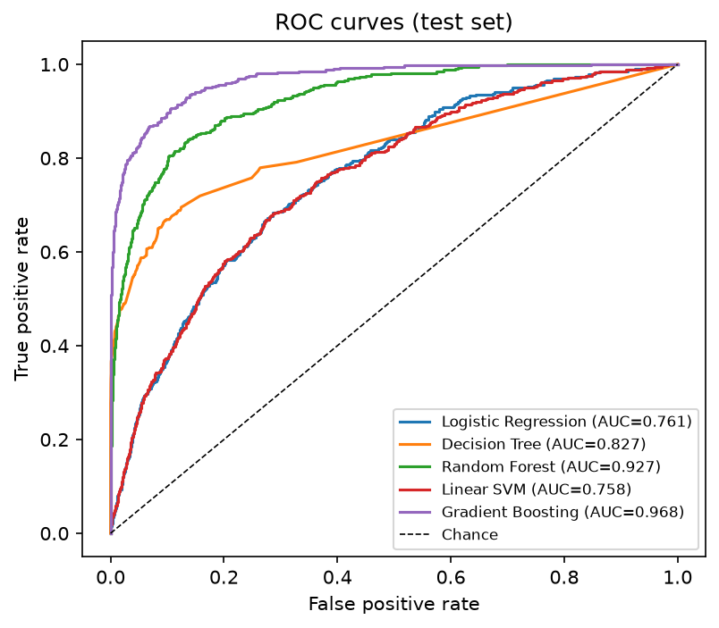
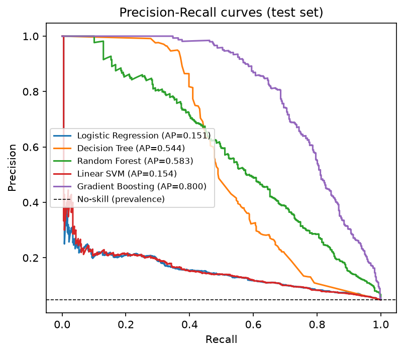
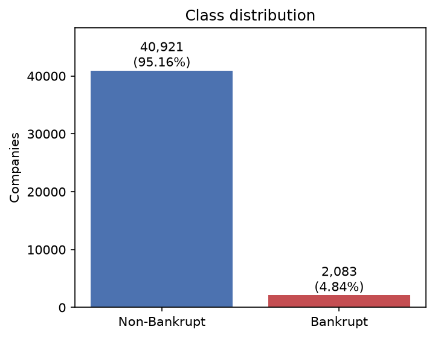
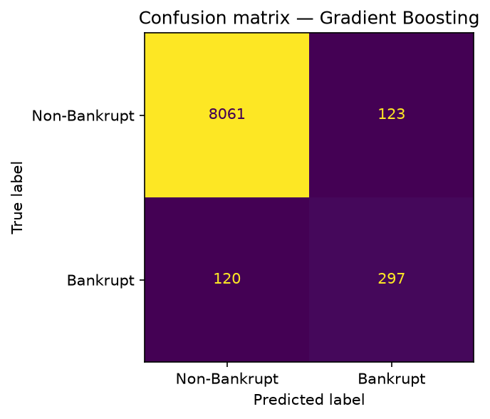
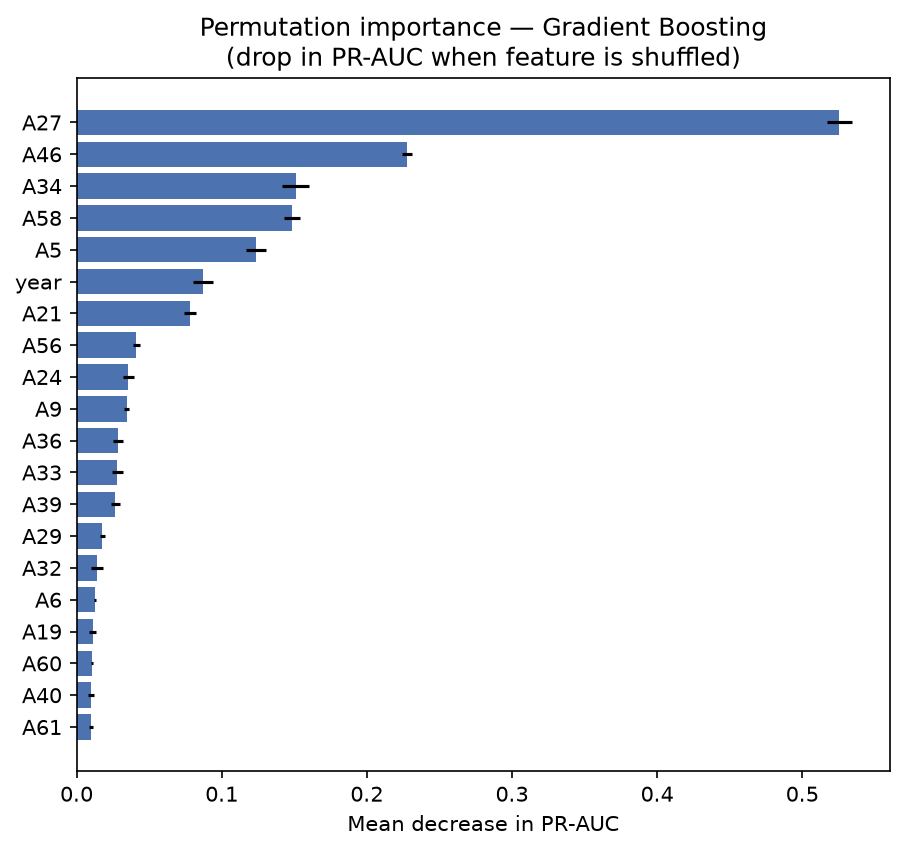

# Corporate Bankruptcy Prediction

UE24CS352A – Machine Learning · Mini-Project · PES University

Binary classification (**Bankrupt** vs **Non-Bankrupt**) on the UCI *Polish Companies Bankruptcy* dataset (id 365). The data is fetched at run time with `ucimlrepo`, so there is no manual download. Several classifiers are tuned and compared with imbalance-aware metrics, and the best one is saved and can be used for predictions from the command line.

## Team

| Member | SRN | Contributions |
|---|---|---|
| Nidhi Karkada | PES2UG24CS314 | Overall ML pipeline, model implementation, evaluation, final integration, live demo execution |
| Nidhi Raghuraman | PES2UG24CS315 | Dataset research, literature review, EDA, visualization, documentation support |
| Piyush A Patel | PES2UG24CS350 | Preprocessing validation, model comparison, GitHub organization, README, presentation preparation |

## Results at a glance

**Best model: Gradient Boosting** (scikit-learn `HistGradientBoosting`), chosen by cross-validated PR-AUC on the training data. On the held-out test set it reaches PR-AUC 0.800 and ROC-AUC 0.968, and it caught 297 of 417 bankrupt firms with 123 false alarms among 8,184 healthy firms.

| Model | Accuracy | Precision | Recall | F1 | ROC-AUC | PR-AUC (test) | PR-AUC (CV) | Rank |
|---|---|---|---|---|---|---|---|---|
| **Gradient Boosting** | 0.972 | 0.707 | 0.712 | 0.710 | 0.968 | **0.800** | **0.836** | 1 |
| Random Forest | 0.964 | 0.783 | 0.345 | 0.479 | 0.927 | 0.583 | 0.626 | 2 |
| Decision Tree | 0.876 | 0.233 | 0.681 | 0.347 | 0.827 | 0.544 | 0.537 | 3 |
| Logistic Regression | 0.745 | 0.114 | 0.626 | 0.192 | 0.761 | 0.151 | 0.170 | 4 |
| Linear SVM | 0.750 | 0.115 | 0.621 | 0.194 | 0.758 | 0.154 | 0.170 | 5 |

Precision, recall, F1 and accuracy use the default 0.5 threshold. Models are ranked by cross-validated PR-AUC, never by test scores. These numbers come from one reference run (seed 42). They can change slightly with other library versions or with the faster `--cv-folds 3 --n-iter 3` option.

Accuracy is shown only to illustrate why it misleads: always predicting "Non-Bankrupt" already scores about 95%.




## Dataset

- **Source:** UCI Machine Learning Repository, *Polish Companies Bankruptcy Data* (id 365), fetched with `fetch_ucirepo(id=365)`. Bankrupt firms were observed in 2000–2012 and still-operating firms in 2007–2013.
- **Features:** 64 financial ratios (`A1`–`A64`) plus a `year` column identifying the forecasting horizon (1 to 5), so each record has 65 input columns. Examples: `A1` = net profit / total assets, `A27` = profit on operating activities / financial expenses.
- **Target:** 0 = did not go bankrupt, 1 = went bankrupt.
- **After removing exact duplicate rows:** 43,004 records, of which 2,083 are bankrupt (4.84%) and 40,921 are not (about 19.6 : 1).
- **Split:** stratified 80/20, giving 34,403 training rows and 8,601 test rows (417 bankrupt, 8,184 healthy).
- **Data issues found:** missing values (`A37` about 44%, `A21` about 14%, `A27` about 6%, `A60` and `A45` about 5%), infinite ratios from division by zero, heavy-tailed outliers and strongly correlated profitability ratios.



## Setup

Requires Python 3.10 or newer (tested on 3.12) and an internet connection for the first dataset fetch.

```bash
git clone https://github.com/apatelpiyush/Corporate-Bankruptcy-Prediction.git
cd Corporate-Bankruptcy-Prediction
python -m venv .venv
source .venv/bin/activate
pip install -r requirements.txt
```

On Windows, activate the environment with `.venv\Scripts\activate` instead of the `source` line.

## Run

Train, evaluate and save the best model (needs internet for the UCI fetch):

```bash
python src/train.py
```

For a faster run with less tuning (useful for a quick check; numbers may differ slightly):

```bash
python src/train.py --cv-folds 3 --n-iter 3
```

Predict with the saved model:

```bash
python src/predict.py --csv results/sample_input.csv
python src/predict.py --template my_input.csv
python src/predict.py --json my_company.json
```

- `--csv` predicts every row of a CSV. `results/sample_input.csv` holds 5 held-out test rows and a `true_class` column so you can compare predictions with the truth.
- `--template` writes a blank CSV containing all required columns (`A1`–`A64` and `year`). Fill it in and pass it back with `--csv`.
- `--json` takes a JSON object (as a string or as a path to a `.json` file) with a value for every feature column. Blank values in CSV input are filled by the saved pipeline.
- The Linear SVM has no probabilities, so if it is ever the selected model, `predict.py` prints the label only.

Example output (Gradient Boosting):

```
Model: Gradient Boosting
--- Row 0 ---
Prediction: Bankrupt
Bankrupt Probability: 99.8%
Non-Bankrupt Probability: 0.2%
```

Probabilities are model estimates from historical data, not certainty.

To explore the analysis step by step, start Jupyter from the project folder and open the notebook:

```bash
jupyter notebook notebooks/bankruptcy_analysis.ipynb
```

Then use Kernel → Restart & Run All.

## How it works

```
Load (UCI) → inspect → drop exact duplicates → EDA → imbalance analysis
→ stratified 80/20 split → per-model Pipeline + RandomizedSearchCV (stratified 5-fold, training data only)
→ test-set evaluation → comparison → interpretation → save best model
```

| Module | Purpose |
|---|---|
| `src/utils.py` | Shared constants (seed 42, test size 0.20, 5 folds, up to 6 search candidates), seeding, folder creation, figure and JSON saving |
| `src/data_loader.py` | Fetch the data, validate target and features, inspect data quality, drop duplicates |
| `src/eda.py` | Class balance, summary statistics, missing values, Spearman correlation heatmap, feature distributions by class |
| `src/preprocessing.py` | Preprocessing pipeline and the class-imbalance analysis |
| `src/train.py` | Model definitions and search spaces, split, tuning, comparison, saving the best model |
| `src/evaluate.py` | Metrics, confusion matrices, ROC and PR curves, comparison table, interpretation plots |
| `src/predict.py` | Command-line predictions from CSV or JSON, template generator |

## Design decisions

- **Preprocessing** (inside each pipeline, refit per CV fold, so nothing leaks from validation or test data): infinity → NaN, median imputation, removal of constant columns. Logistic Regression and Linear SVM additionally get `RobustScaler` and clipping to ±10. Outliers are analysed, not removed, because extreme ratios are normal in finance.
- **Class imbalance:** class weights (`balanced`). The code prints the actual ratio and why undersampling, oversampling and SMOTE were not chosen. Nothing is removed or synthesised, so the test set stays untouched.
- **Models:** Logistic Regression, Decision Tree, Random Forest, Linear SVM (`LinearSVC`; kernel SVC is impractical at this row count) and `HistGradientBoosting` (a fast gradient-boosting implementation). XGBoost is omitted to avoid an extra dependency.
- **Tuning and selection:** `RandomizedSearchCV` with stratified 5-fold CV on training data only, scored by PR-AUC because accuracy misleads under imbalance. The final model is chosen by cross-validated PR-AUC, so the test set is used only once, for the final report.
- **Interpretation:** logistic regression coefficients, a decision-tree plot (top 3 levels), Random Forest importances and permutation importance for the selected model. SHAP is not used.

## Findings

- **Gradient Boosting wins** on PR-AUC and ROC-AUC, with precision, recall and F1 all about 0.71. Cross-validated and test PR-AUC are close for every model, so the selection is stable.
- **Random Forest** has the highest precision (0.78) but misses most bankruptcies (recall 0.35) at the 0.5 threshold.
- **Logistic Regression and Linear SVM** catch about 62% of bankruptcies but flag about 25% of healthy firms. This is likely because a straight-line boundary cannot capture non-linear relationships between ratios.
- **Most influential features** (permutation importance on the Gradient Boosting model):
  - `A27`: operating profit / financial expenses (ability to cover financial costs)
  - `A46`: (current assets − inventory) / short-term liabilities (short-term liquidity)
  - `A34`: operating expenses / total liabilities
  - `A58`: total costs / total sales (cost efficiency)
  - `A5`: a cash-coverage ratio
  - `year` also ranks as important, because it tells the model which forecasting horizon a row comes from.




## Limitations and future work

- Fixed 0.5 decision threshold with no threshold tuning. With class weights, a tuned threshold could trade precision against recall.
- The split is random at row level. If the same company appears in several years' files, its rows could land in both train and test. The dataset has no company identifier, so this cannot be checked.
- Data covers Polish firms in one period, so results may not transfer to other markets or years.
- Future work: threshold tuning, SHAP explanations, testing resampling methods such as SMOTE, XGBoost, and newer data.

## Repository layout

```
src/          source code (utils, data_loader, eda, preprocessing, train, evaluate, predict)
notebooks/    bankruptcy_analysis.ipynb
results/
  figures/    generated plots
  metrics/    generated tables and JSON files
models/       best_model.joblib and model_metadata.json (created by train.py)
docs/         project write-up and presentation material
requirements.txt
```

### Generated outputs (after `train.py`)

- `results/metrics/`: dataset_inspection.json, feature_summary.csv, class_distribution.csv, summary_statistics.csv, top_correlated_pairs.csv, imbalance_analysis.json, hyperparameters.json, cv_results_*.csv, classification_report_*.txt, confusion_matrix_*.csv, model_comparison.csv, logistic_regression_coefficients.csv, random_forest_feature_importance.csv, permutation_importance_best_model.csv
- `results/figures/`: class_distribution, missing_values, correlation_heatmap, feature_distributions, confusion_matrix_*, roc_curves, pr_curves, interpret_*
- `results/sample_input.csv`, `models/best_model.joblib`, `models/model_metadata.json`

## Troubleshooting

- **Dataset download fails:** the first run needs access to the UCI repository. Check your internet or network settings and try again.
- **Version warning or error in `predict.py`:** install the same scikit-learn version used for training, which is recorded in `models/model_metadata.json`.
- **Notebook import errors:** start Jupyter from the project root folder so the notebook can find `src/`.

